[](https://mseep.ai/app/saptadey-adaptive-graph-of-thoughts-mcp-server)

# 🧠 Adaptive Graph of Thoughts

<div align="center">

[](https://saptadey.github.io/Adaptive-Graph-of-Thoughts-MCP-server/)
[](https://www.python.org/downloads/)
[](LICENSE)
[](Dockerfile)
[](https://fastapi.tiangolo.com)
[](https://networkx.org)
[](CHANGELOG.md)
[](https://smithery.ai/server/@SaptaDey/graph-of-thought-mcp)
[](https://github.com/SaptaDey/Adaptive-Graph-of-Thoughts-MCP-server/actions/workflows/codacy.yml)
[](https://github.com/SaptaDey/Adaptive-Graph-of-Thoughts-MCP-server/actions/workflows/codeql.yml)
[](https://github.com/SaptaDey/Adaptive-Graph-of-Thoughts-MCP-server/actions/workflows/dependabot/dependabot-updates)
[](https://mseep.ai/app/b56538c9-7a30-45b3-851c-447fe2eb24a6)

**🚀 Next-Generation AI Reasoning Framework for Scientific Research**

*Leveraging graph structures to transform how AI systems approach scientific reasoning*

</div>

---

## 🔍 Overview

Adaptive Graph of Thoughts (AGoT) is a **high-performance MCP server** that implements the **Advanced Scientific Reasoning Graph-of-Thoughts (ASR-GoT)** framework. It uses a **Neo4j graph database** as a dynamic knowledge store and exposes reasoning capabilities through the **Model Context Protocol (MCP)**, enabling seamless integration with AI assistants like Claude Desktop.

### Key Highlights

| Feature | Description |
|---------|-------------|
| 🧠 **Graph-Based Reasoning** | Multi-stage pipeline with 8 specialized reasoning stages |
| 📊 **Dynamic Confidence Scoring** | Multi-dimensional evaluation with uncertainty quantification |
| 🔬 **Evidence Integration** | Real-time connection to PubMed, Google Scholar & Exa Search |
| ⚡ **High Performance** | Async FastAPI with Neo4j graph operations |
| 🔌 **MCP Protocol** | Native Claude Desktop & VS Code integration |
| 🐳 **Cloud-Ready** | Full Docker + Kubernetes (Helm) support |

---

## 🏗️ System Architecture

```mermaid
%%{init: {'theme': 'base', 'themeVariables': {'primaryColor': '#4A90D9', 'primaryTextColor': '#fff', 'primaryBorderColor': '#2C5F8A', 'lineColor': '#666', 'secondaryColor': '#52B788', 'tertiaryColor': '#F8F9FA'}}}%%
graph TB
    subgraph Clients["🖥️ Client Layer"]
        CD["🤖 Claude Desktop"]
        VS["💻 VS Code / Cursor"]
        CC["🔗 Custom MCP Clients"]
    end

    subgraph Gateway["🌐 API Gateway Layer"]
        MCP_EP["⚡ MCP Endpoint\n/mcp"]
        NLQ_EP["🔍 NLQ Endpoint\n/nlq"]
        GE_EP["📊 Graph Explorer\n/graph"]
        HE["💚 Health Check\n/health"]
    end

    subgraph Core["🧠 Core Application Layer"]
        direction TB
        GTP["🔄 GoT Processor\nOrchestrator"]
        subgraph Pipeline["ASR-GoT 8-Stage Pipeline"]
            S1["1️⃣ Init &\nContext Setup"]
            S2["2️⃣ Query\nDecomposition"]
            S3["3️⃣ Hypothesis\nGeneration"]
            S4["4️⃣ Evidence\nIntegration"]
            S5["5️⃣ Pruning &\nMerging"]
            S6["6️⃣ Subgraph\nExtraction"]
            S7["7️⃣ Synthesis &\nComposition"]
            S8["8️⃣ Reflection &\nAudit"]
            S1 --> S2 --> S3 --> S4 --> S5 --> S6 --> S7 --> S8
        end
        GTP --> Pipeline
    end

    subgraph Services["🛠️ Service Layer"]
        LLM["🤖 LLM Service\nOpenAI / Claude"]
        EDB["📚 Evidence DB\nPubMed · Scholar · Exa"]
    end

    subgraph Storage["🗄️ Storage Layer"]
        NEO4J["📦 Neo4j\nGraph Database"]
        CONFIG["⚙️ Config\n(YAML + ENV)"]
    end

    Clients -->|"MCP JSON-RPC\nBearer Auth"| Gateway
    MCP_EP --> GTP
    NLQ_EP --> LLM
    GE_EP --> NEO4J
    GTP --> Services
    GTP --> NEO4J
    LLM --> EDB

    style Clients fill:#E3F2FD,stroke:#1565C0
    style Gateway fill:#F3E5F5,stroke:#6A1B9A
    style Core fill:#E8F5E9,stroke:#1B5E20
    style Services fill:#FFF8E1,stroke:#F57F17
    style Storage fill:#FCE4EC,stroke:#880E4F
```



---

## 🔄 ASR-GoT Reasoning Pipeline

The 8-stage reasoning pipeline transforms a raw question into a comprehensive, evidence-backed answer stored in the knowledge graph:

```mermaid
%%{init: {'theme': 'base', 'themeVariables': {'primaryColor': '#7B68EE', 'edgeLabelBackground': '#fff'}}}%%
flowchart LR
    Q([❓ Scientific\nQuestion]) --> S1

    subgraph S1["Stage 1: Initialization"]
        I1["Set context\n& parameters"]
        I2["Create root\ngraph node"]
        I1 --> I2
    end

    subgraph S2["Stage 2: Decomposition"]
        D1["Identify\nsub-questions"]
        D2["Map knowledge\ndomains"]
        D1 --> D2
    end

    subgraph S3["Stage 3: Hypothesis"]
        H1["Generate\nhypotheses"]
        H2["Score initial\nconfidence"]
        H1 --> H2
    end

    subgraph S4["Stage 4: Evidence"]
        E1["Query PubMed\nScholar · Exa"]
        E2["Integrate\nevidence nodes"]
        E1 --> E2
    end

    subgraph S5["Stage 5: Pruning"]
        P1["Remove weak\nhypotheses"]
        P2["Merge related\nnodes"]
        P1 --> P2
    end

    subgraph S6["Stage 6: Subgraph"]
        SG1["Extract key\nsubgraphs"]
        SG2["Score relevance\n& centrality"]
        SG1 --> SG2
    end

    subgraph S7["Stage 7: Synthesis"]
        C1["Compose final\nnarrative"]
        C2["Build\nconclusions"]
        C1 --> C2
    end

    subgraph S8["Stage 8: Reflection"]
        R1["Audit\nconsistency"]
        R2["Return final\nresult"]
        R1 --> R2
    end

    S1 --> S2 --> S3 --> S4 --> S5 --> S6 --> S7 --> S8
    S8 --> A([✅ Reasoned\nAnswer])

    style Q fill:#FFD700,stroke:#DAA520,color:#000
    style A fill:#90EE90,stroke:#228B22,color:#000
```



---

## 🕸️ Knowledge Graph Connectome

The Neo4j knowledge graph captures the reasoning structure as a rich connectome — nodes represent concepts, hypotheses, and evidence, while edges represent semantic and logical relationships:

```mermaid
%%{init: {'theme': 'base', 'themeVariables': {'primaryColor': '#6C63FF', 'primaryTextColor': '#fff', 'edgeLabelBackground': '#f0f0ff'}}}%%
graph TD
    RootQuery["🔍 Root Query\n(Session Node)"]

    subgraph Decomp["📐 Decomposition Layer"]
        D1["📌 Sub-question A\n[domain: biology]"]
        D2["📌 Sub-question B\n[domain: chemistry]"]
        D3["📌 Sub-question C\n[domain: physics]"]
    end

    subgraph Hypo["💡 Hypothesis Layer"]
        H1["💭 Hypothesis 1\nconf: 0.85"]
        H2["💭 Hypothesis 2\nconf: 0.72"]
        H3["💭 Hypothesis 3\nconf: 0.61"]
        H4["💭 Hypothesis 4\nconf: 0.90"]
    end

    subgraph Evid["🔬 Evidence Layer"]
        E1["📄 PubMed Paper\nPMID: 38492"]
        E2["📄 Scholar Article\nDOI: 10.1038/..."]
        E3["🌐 Exa Result\nexpert consensus"]
        E4["📊 Statistical\nMeta-analysis"]
    end

    subgraph Synth["🎯 Synthesis Layer"]
        C1["✅ Merged\nConclusion A"]
        C2["✅ Merged\nConclusion B"]
        FINAL["🏆 Final Answer\n[confidence: 0.88]"]
    end

    RootQuery -->|"DECOMPOSES_TO"| D1
    RootQuery -->|"DECOMPOSES_TO"| D2
    RootQuery -->|"DECOMPOSES_TO"| D3

    D1 -->|"GENERATES"| H1
    D1 -->|"GENERATES"| H2
    D2 -->|"GENERATES"| H3
    D3 -->|"GENERATES"| H4

    H1 -->|"SUPPORTED_BY"| E1
    H2 -->|"SUPPORTED_BY"| E2
    H3 -->|"CONTRADICTED_BY"| E3
    H4 -->|"SUPPORTED_BY"| E4

    H1 -->|"MERGES_WITH"| C1
    H4 -->|"MERGES_WITH"| C1
    H2 -->|"MERGES_WITH"| C2
    C1 -->|"SYNTHESIZES_TO"| FINAL
    C2 -->|"SYNTHESIZES_TO"| FINAL

    style RootQuery fill:#4A90D9,color:#fff,stroke:#2C5F8A
    style FINAL fill:#27AE60,color:#fff,stroke:#1E8449
    style H3 fill:#E74C3C,color:#fff,stroke:#C0392B
```



---

## 🔁 Request Flow

```mermaid
%%{init: {'theme': 'base'}}%%
sequenceDiagram
    actor User as 🤖 Claude / MCP Client
    participant API as ⚡ FastAPI Server
    participant Auth as 🔐 Auth Middleware
    participant GTP as 🧠 GoT Processor
    participant NEO as 📦 Neo4j DB
    participant LLM as 🤖 LLM Service

    User->>API: POST /mcp {"method": "asr_got.query"}
    API->>Auth: Verify Bearer Token
    Auth-->>API: ✅ Authorized

    API->>GTP: Process query
    GTP->>NEO: Create session + root node

    loop 8 Pipeline Stages
        GTP->>LLM: Generate hypotheses / summaries
        LLM-->>GTP: LLM response
        GTP->>NEO: Write nodes & relationships
        NEO-->>GTP: Confirmed
    end

    GTP->>NEO: Extract final subgraph
    NEO-->>GTP: Final answer graph
    GTP-->>API: Structured result

    API-->>User: JSON-RPC response\n{result, confidence, graph_state}
```



---

## 📚 Documentation

**Full documentation including API reference, configuration guide, and contribution guidelines:**

**[➡️ Adaptive Graph of Thoughts Documentation Site](https://adaptive-thought-web-weaver.lovable.app)**

## 📂 Project Structure

```
Adaptive-Graph-of-Thoughts-MCP-server/
├── 📁 .github/             # CI/CD workflows (CodeQL, Dependabot)
├── 📁 agt_setup/           # Interactive setup wizard CLI
├── 📁 config/              # settings.yaml configuration
├── 📁 docs_src/            # MkDocs documentation source
├── 📁 helm/                # Kubernetes Helm chart
├── 📁 src/
│   └── 📁 adaptive_graph_of_thoughts/
│       ├── 📁 api/         # FastAPI routes & schemas
│       ├── 📁 application/ # GoTProcessor orchestrator
│       ├── 📁 domain/      # 8-stage pipeline & models
│       ├── 📁 infrastructure/ # Neo4j utilities
│       └── 📁 services/    # LLM & external API clients
├── 📁 tests/               # Comprehensive test suite
├── Dockerfile
├── docker-compose.yml
├── pyproject.toml
└── README.md
```

## 🚀 Quick Start

```bash
git clone https://github.com/SaptaDey/Adaptive-Graph-of-Thoughts-MCP-server.git
cd Adaptive-Graph-of-Thoughts-MCP-server
poetry install
poetry run python -m agt_setup   # Interactive credential setup wizard
poetry run uvicorn adaptive_graph_of_thoughts.main:app --reload
```

Visit `http://localhost:8000/docs` for the interactive API documentation.

## 🚀 Getting Started

### Deployment Prerequisites

Before running Adaptive Graph of Thoughts (either locally or via Docker if not using the provided `docker-compose.prod.yml` which includes Neo4j), ensure you have:

-   **A running Neo4j Instance**: Adaptive Graph of Thoughts requires a connection to a Neo4j graph database.
    -   **APOC Library**: Crucially, the Neo4j instance **must** have the APOC (Awesome Procedures On Cypher) library installed. Several Cypher queries within the application's reasoning stages utilize APOC procedures (e.g., `apoc.create.addLabels`, `apoc.merge.node`). Without APOC, the application will not function correctly. You can find installation instructions on the [official APOC website](https://neo4j.com/labs/apoc/installation/).
    -   **Configuration**: Ensure that your `config/settings.yaml` (or corresponding environment variables) correctly points to your Neo4j instance URI, username, and password.
    -   **Indexing**: For optimal performance, ensure appropriate Neo4j indexes are created. You can run `python scripts/run_cypher_migrations.py` to apply the provided Cypher migrations automatically. See [Neo4j Indexing Strategy](docs_src/neo4j_indexing.md) for details.

    *Note: The provided `docker-compose.yml` (for development) and `docker-compose.prod.yml` (for production) already include a Neo4j service with the APOC library pre-configured, satisfying this requirement when using Docker Compose.*

### Prerequisites

- **Python 3.11+** (as specified in `pyproject.toml`, e.g., the Docker image uses Python 3.11.x or 3.12.x, 3.13.x)
- **[Poetry](https://python-poetry.org/docs/#installation)**: For dependency management
- **[Docker](https://www.docker.com/get-started)** and **[Docker Compose](https://docs.docker.com/compose/install/)**: For containerized deployment

### Installation and Setup (Local Development)

1. **Clone the repository**:
   ```bash
   git clone https://github.com/SaptaDey/Adaptive-Graph-of-Thoughts-MCP-server.git
   cd Adaptive-Graph-of-Thoughts-MCP-server
   ```

2. **Install dependencies using Poetry**:
   ```bash
   poetry install
   ```
   This creates a virtual environment and installs all necessary packages specified in `pyproject.toml`.

3. **Activate the virtual environment**:
   ```bash
   poetry shell
   ```

4. **Configure the application**:
   ```bash
   # Copy example configuration
   cp config/settings.example.yaml config/settings.yaml
   
   # Edit configuration as needed
   vim config/settings.yaml
   ```

5. **Set up environment variables** (optional):
   ```bash
   # Create .env file for sensitive configuration
   echo "LOG_LEVEL=DEBUG" > .env
   echo "API_HOST=0.0.0.0" >> .env
   echo "API_PORT=8000" >> .env
   ```

### Secret Management

In production environments, set the `SECRETS_PROVIDER` environment variable to
`aws`, `gcp`, or `vault` to fetch sensitive values from a supported secrets
manager. Optionally provide `<VAR>_SECRET_NAME` variables (for example
`OPENAI_API_KEY_SECRET_NAME`) to control the name of each secret. When a secrets
provider is configured, values for `OPENAI_API_KEY`, `ANTHROPIC_API_KEY`, and
`NEO4J_PASSWORD` are loaded automatically at startup.

6. **Run the development server**:
   ```bash
   python src/adaptive_graph_of_thoughts/main.py
   ```
   
   Alternatively, for more control:
   ```bash
   uvicorn adaptive_graph_of_thoughts.main:app --reload --host 0.0.0.0 --port 8000
   ```
   
   The API will be available at `http://localhost:8000`.

## ✨ Setup Wizard

An interactive wizard is available to streamline initial configuration.

```bash
poetry run python -m agt_setup
```

Then visit `http://localhost:8000/setup` to complete the web-based steps.

*Setup wizard demo GIF will appear here in the full documentation.*


### Docker Deployment

```mermaid
graph TB
    subgraph "Development Environment"
        A[👨‍💻 Developer] --> B[🐳 Docker Compose]
    end
    
    subgraph "Container Orchestration"
        B --> C[📦 Adaptive Graph of Thoughts Container]
        B --> D[📊 Monitoring Container]
        B --> E[🗄️ Database Container]
    end
    
    subgraph "Adaptive Graph of Thoughts Application"
        C --> F[⚡ FastAPI Server]
        F --> G[🧠 ASR-GoT Engine]
        F --> H[🔌 MCP Protocol]
    end
    
    subgraph "External Integrations"
        H --> I[🤖 Claude Desktop]
        H --> J[🔗 Other AI Clients]
    end
    
    style A fill:#e1f5fe
    style B fill:#f3e5f5
    style C fill:#e8f5e8
    style F fill:#fff3e0
    style G fill:#ffebee
    style H fill:#f1f8e9
```



1. **Quick Start with Docker Compose**:
   ```bash
   # Build and run all services
   docker-compose up --build
   
   # For detached mode (background)
   docker-compose up --build -d
   
   # View logs
   docker-compose logs -f adaptive-graph-of-thoughts
   ```

2. **Individual Docker Container**:
   ```bash
   # Build the image
   docker build -t adaptive-graph-of-thoughts:latest .
   
   # Run the container
   docker run -p 8000:8000 -v $(pwd)/config:/app/config adaptive-graph-of-thoughts:latest
   ```

3. **Production Deployment**:
   ```bash
   # Use production compose file
   docker-compose -f docker-compose.prod.yml up --build -d
   ```

### Kubernetes Deployment (Helm)

A minimal [Helm](https://helm.sh/) chart is provided under `helm/agot-server` for
running Adaptive Graph of Thoughts on a Kubernetes cluster.

```bash
helm install agot helm/agot-server
```

Customize values in `helm/agot-server/values.yaml` to set the image repository,
resource limits, and other options.

### Notes on Specific Deployment Platforms

-   **Smithery.ai**: Deploy using the included `smithery.yaml`.
    *   Connect your GitHub repository on Smithery and click **Deploy**.
    *   The container listens on the `PORT` environment variable (default `8000`).
    *   **Health Checks** rely on the `/health` endpoint.
    *   The `Dockerfile` and `docker-compose.prod.yml` illustrate the container setup.

4. **Access the Services**:
   - **API Documentation**: `http://localhost:8000/docs`
   - **Health Check**: `http://localhost:8000/health`
   - **MCP Endpoint**: `http://localhost:8000/mcp`

## 🔌 MCP Client Integration

### Supported MCP Clients

Adaptive Graph of Thoughts supports integration with various MCP clients:

- **Claude Desktop** - Full STDIO and HTTP support
- **VS Code** - Via MCP extensions
- **Custom MCP Clients** - Generic configuration available

### Quick Client Setup

#### Claude Desktop / VS Code settings
```json
{
  "mcpServers": {
    "adaptive-graph-of-thoughts": {
      "command": "python",
      "args": ["-m", "adaptive_graph_of_thoughts.main"],
      "cwd": "/path/to/Adaptive-Graph-of-Thoughts-MCP-server",
      "env": {
        "NEO4J_URI": "bolt://localhost:7687",
        "NEO4J_USER": "neo4j",
        "NEO4J_PASSWORD": "your_password",
        "MCP_TRANSPORT_TYPE": "stdio"
      }
    }
  }
}
```

## Available MCP Tools

| Tool | Description |
|------|-------------|
| `scientific_reasoning_query` | Advanced scientific reasoning with graph analysis |
| `analyze_research_hypothesis` | Hypothesis evaluation with confidence scoring |
| `explore_scientific_relationships` | Concept relationship mapping |
| `validate_scientific_claims` | Evidence-based claim validation |


## 🔌 API Endpoints

The primary API endpoints exposed by Adaptive Graph of Thoughts are:

- **MCP Protocol Endpoint**: `POST /mcp`
  - This endpoint is used for communication with MCP clients like Claude Desktop.
  - Example Request for the `asr_got.query` method:
    ```json
    {
      "jsonrpc": "2.0",
      "method": "asr_got.query",
      "params": {
        "query": "Analyze the relationship between microbiome diversity and cancer progression.",
        "parameters": {
          "include_reasoning_trace": true,
          "include_graph_state": false
        }
      },
      "id": "123"
    }
    ```
  - Other supported MCP methods include `initialize` and `shutdown`.

- **Health Check Endpoint**: `GET /health`
  - Provides a simple health status of the application.
  - Example Response:
    ```json
    {
      "status": "healthy",
      "version": "0.1.0" 
    }
    ```

The advanced API endpoints previously listed (e.g., `/api/v1/graph/query`) are not implemented in the current version and are reserved for potential future development.

## Session Handling (`session_id`)

Currently, the `session_id` parameter available in API requests (e.g., for `asr_got.query`) and present in responses serves primarily to identify and track a single, complete query-response cycle. It is also used for correlating progress notifications (like `got/queryProgress`) with the originating query.

While the system generates and utilizes `session_id`s, Adaptive Graph of Thoughts does not currently support true multi-turn conversational continuity where the detailed graph state or reasoning context from a previous query is automatically loaded and reused for a follow-up query using the same `session_id`. Each query is processed independently at this time.

### Future Enhancement: Persistent Sessions

A potential future enhancement for Adaptive Graph of Thoughts is the implementation of persistent sessions. This would enable more interactive and evolving reasoning processes by allowing users to:

1.  **Persist State:** Store the generated graph state and relevant reasoning context from a query, associated with its `session_id`, likely within the Neo4j database.
2.  **Reload State:** When a new query is submitted with an existing `session_id`, the system could reload this saved state as the starting point for further processing.
3.  **Refine and Extend:** Allow the new query to interact with the loaded graph—for example, by refining previous hypotheses, adding new evidence to existing structures, or exploring alternative reasoning paths based on the established context.

Implementing persistent sessions would involve developing robust strategies for:
*   Efficiently storing and retrieving session-specific graph data in Neo4j.
*   Managing the lifecycle (e.g., creation, update, expiration) of session data.
*   Designing sophisticated logic for how new queries merge with, modify, or extend pre-existing session contexts and graphs.

This is a significant feature that could greatly enhance the interactive capabilities of Adaptive Graph of Thoughts. Contributions from the community in designing and implementing persistent session functionality are welcome.

### Future Enhancement: Asynchronous and Parallel Stage Execution

Currently, the 8 stages of the Adaptive Graph of Thoughts reasoning pipeline are executed sequentially. For complex queries or to further optimize performance, exploring asynchronous or parallel execution for certain parts of the pipeline is a potential future enhancement.

**Potential Areas for Parallelism:**

*   **Hypothesis Generation:** The `HypothesisStage` generates hypotheses for each dimension identified by the `DecompositionStage`. The process of generating hypotheses for *different, independent dimensions* could potentially be parallelized. For instance, if three dimensions are decomposed, three parallel tasks could work on generating hypotheses for each respective dimension.
*   **Evidence Integration (Partial):** Within the `EvidenceStage`, if multiple hypotheses are selected for evaluation, the "plan execution" phase (simulated evidence gathering) for these different hypotheses might be performed concurrently.

**Challenges and Considerations:**

Implementing parallel stage execution would introduce complexities that need careful management:

*   **Data Consistency:** Concurrent operations, especially writes to the Neo4j database (e.g., creating multiple hypothesis nodes or evidence nodes simultaneously), must be handled carefully to ensure data integrity and avoid race conditions. Unique ID generation schemes would need to be robust for parallel execution.
*   **Transaction Management:** Neo4j transactions for concurrent writes would need to be managed appropriately.
*   **Dependency Management:** Ensuring that stages (or parts of stages) that truly depend on the output of others are correctly sequenced would be critical.
*   **Resource Utilization:** Parallel execution could increase resource demands (CPU, memory, database connections).
*   **Complexity:** The overall control flow of the `GoTProcessor` would become more complex.

While the current sequential execution ensures a clear and manageable data flow, targeted parallelism in areas like hypothesis generation for independent dimensions could offer performance benefits for future versions of Adaptive Graph of Thoughts. This remains an open area for research and development.

## 🧪 Testing & Quality Assurance

<div align="center">
  <table>
    <tr>
      <td align="center">🧪<br><b>Testing</b></td>
      <td align="center">🔍<br><b>Type Checking</b></td>
      <td align="center">✨<br><b>Linting</b></td>
      <td align="center">📊<br><b>Coverage</b></td>
    </tr>
    <tr>
      <td align="center">
        <pre>poetry run pytest</pre>
        <pre>make test</pre>
      </td>
      <td align="center">
        <pre>poetry run mypy src/</pre>
        <pre>pyright src/</pre>
      </td>
      <td align="center">
        <pre>poetry run ruff check .</pre>
        <pre>poetry run ruff format .</pre>
      </td>
      <td align="center">
        <pre>poetry run pytest --cov=src</pre>
        <pre>coverage html</pre>
      </td>
    </tr>
  </table>
</div>

### Development Commands

Continuous integration pipelines on GitHub Actions run tests, CodeQL analysis, and Microsoft Defender for DevOps security scans.


```bash
# Run full test suite with coverage using Poetry
poetry run pytest --cov=src --cov-report=html --cov-report=term

# Or using Makefile for the default test run
make test

# Run specific test categories (using poetry)
poetry run pytest tests/unit/stages/          # Stage-specific tests
poetry run pytest tests/integration/         # Integration tests
poetry run pytest -k "test_confidence"       # Tests matching pattern

# Type checking and linting (can also be run via Makefile targets: make lint, make check-types)
poetry run mypy src/ --strict                # Strict type checking
poetry run ruff check . --fix                # Auto-fix linting issues
poetry run ruff format .                     # Format code

# Pre-commit hooks (recommended)
poetry run pre-commit install                # Install hooks
poetry run pre-commit run --all-files       # Run all hooks (runs Ruff and MyPy)

# See Makefile for other useful targets like 'make all-checks'.
```

## 🖥 Dashboard Tour

*Dashboard demo GIF coming soon.*

## 💻 IDE Integration

Use the `vscode-agot` extension to query the server from VS Code. Run the extension and execute **AGoT: Ask Graph…** from the Command Palette.

## ❓ Troubleshooting

If the server fails to start or setup reports errors, ensure your Neo4j instance is running and the credentials in `.env` are correct. Consult the console output for details.

## 🗺️ Roadmap and Future Directions

We have an exciting vision for the future of Adaptive Graph of Thoughts! Our roadmap includes plans for enhanced graph visualization, integration with more data sources like Arxiv, and further refinements to the core reasoning engine.

For more details on our planned features and long-term goals, please see our [Roadmap](ROADMAP.md) (also available on the documentation site).

## 🤝 Contributing

We welcome contributions! Please see our [Contributing Guidelines](CONTRIBUTING.md) (also available on the documentation site) for details on how to get started, our branching strategy, code style, and more.

## 📄 License

This project is licensed under the Apache License 2.0. [License](LICENSE).

## 🔒 Security

Please see our [Security Policy](SECURITY.md) for reporting vulnerabilities and details on supported versions.

## 🙏 Acknowledgments

- **NetworkX** community for graph analysis capabilities
- **FastAPI** team for the excellent web framework
- **Pydantic** for robust data validation
- The scientific research community for inspiration and feedback

---

<div align="center">
  <p><strong>Built with ❤️ for the scientific research community</strong></p>
  <p><em>Adaptive Graph of Thoughts - Advancing scientific reasoning through intelligent graph structures</em></p>
</div>

